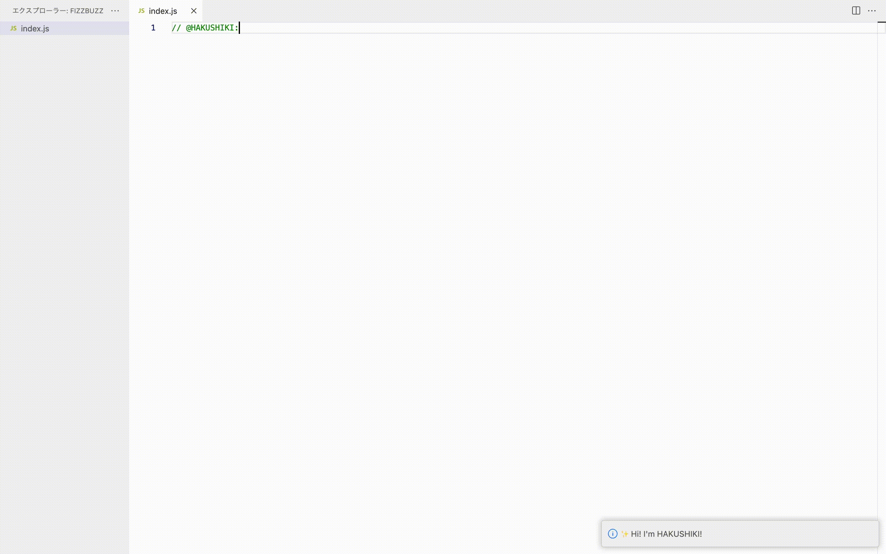

# HAKUSHIKI Code README
## **Features**

数秒以内に日本語コメントからコードを生成できます！ 

**🤖 現在コード生成に対応している言語**  
JavaScript

**💫 オープンソースです！** 
[GitHub](https://github.com/koshin01/hakushiki_code)

## **How to**

HAKUSHIKI Code の使い方はとても簡単です。

### **Step 1**
右クリックでメニューを出して、HAKUSHIKI Code Activate を選択する
### **Step 2**
コメントで、＠HAKUSHIKI: と入力して改行する 
### **Step 3**
生成されたコードを見ながら休憩する🍩

## **FAQ**

😵: 改行しても何の反応もない 
🧑🏻‍💻: コメントが間違えている可能性があります。@HAKUSHIKI: とコロンまでつけて改行してください！

😵: コードが生成できない 
🧑🏻‍💻: 生成しようとしている言語が対応していない可能性があります。
※ 現在対応している言語はJavaScript のみです。

## **Release Notes**

### 0.0.1
2023年2月27日 
🎉 リリース

### 1.0.1
2023年2月27日 
📝 README の改善

## **Developer**
🧑🏻‍💻 koshin 
東京でソフトウェアエンジニアしています！

👇より詳しく 
[Wantedly](https://www.wantedly.com/id/koshin2001)

